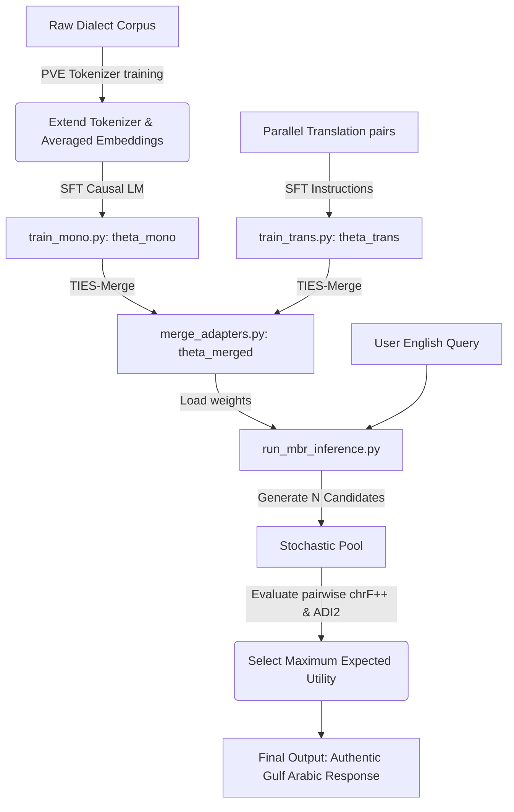

# KETA-Net Project Architecture Guide

Welcome to the **KETA-Net** codebase! This guide provides a file-by-file explanation of the framework's architecture, helping you understand how it adapts Large Language Models (LLMs) to be domain-specific and fluent in colloquial Dialectal Arabic (DA) varieties (like Gulf/Khaleeji Arabic) under memory-bound serving constraints.

---

## What is KETA-Net?

Arabic is characterized by **diglossia**:
*   **Modern Standard Arabic (MSA)**: Used for formal publications, news, and official writing.
*   **Dialectal Arabic (DA)**: Used for everyday conversation, social media, and customer support.

Standard LLMs are trained primarily on MSA and English. When adapted to colloquial dialects, they suffer from:
1.  **Tokenization Fragmentation**: Dialectal words are split into tiny, meaningless subwords (inflating sequence length and slowing decoding).
2.  **Parameter Interference**: Training on slang/conversational style corrupts the model's core translation and reasoning abilities (dialectal drift).
3.  **VRAM Serving Bloat**: Advanced decoding strategies (like generating multiple candidates) multiply Key-Value (KV) cache memory.

**KETA-Net** solves these problems using four main steps: **Progressive Vocabulary Expansion (PVE)**, **Layer-Wise LoRA (LW-LoRA)**, **TIES-Merging**, and **Dialect-Aware Minimum Bayes Risk (MBR) Decoding**.

---

## File-by-File Explanation

### 1. `keta/tokenizer/pve.py` (Progressive Vocabulary Expansion)
*   **Purpose**: Enhances the tokenizer to understand dialectal subwords natively, reducing sequence length and speeding up inference.
*   **Key Functions**:
    *   `train_dialect_vocabulary`: Reads your raw dialect corpus and uses a Byte-Pair Encoding (BPE) algorithm to extract the most common new words and morphemes that are missing from the base model's vocabulary.
    *   `expand_vocabulary_and_embeddings`: Resizes the model's embedding tables to fit the new tokens. It initializes the new tokens by **averaging the embeddings of their constituent subword fragments** (from the ancestral tokenizer). This ensures the model starts with a semantic understanding of the new tokens, avoiding "Out-Of-Vocabulary (OOV) shock".

---

### 2. `keta/models/probing.py` (Layer-Wise Probing)
*   **Purpose**: Identifies which transformer layers are most sensitive to dialectal style and tone.
*   **Key Class**:
    *   `LayerWiseProbe`: Collects hidden states layer-by-layer during a forward pass. It then trains lightweight Logistic Regression classifiers (probes) to predict if a sentence is dialectal. The layers with the highest accuracy (macro-F1 score) are identified as "style-sensitive intermediate layers" (empirically layers 14 to 26 in a 32-layer Qwen model).

---

### 3. `keta/models/peft_utils.py` (Targeted LW-LoRA Configuration)
*   **Purpose**: Restricts Low-Rank Adaptation (LoRA) updates strictly to the style-sensitive layers found during probing.
*   **Key Function**:
    *   `get_keta_peft_model`: Customizes Unsloth's `FastLanguageModel.get_peft_model`. It passes the `layers_to_transform` parameter to restrict PEFT to intermediate blocks (e.g. layers 14 to 26). By keeping the other layers frozen, you capture 98% of the dialectal tone, **save 40% VRAM**, and prevent the model from forgetting its general knowledge.

---

### 4. `keta/models/merging.py` (TIES-Merging Math)
*   **Purpose**: Merges two adapters ($\theta_{\text{mono}}$ and $\theta_{\text{trans}}$) without parameter conflict.
*   **Key Function**:
    *   `ties_merge_state_dicts`: Implements the TIES-Merging algorithm on the PyTorch weights:
        1.  **Trim**: Prunes the smallest 80% of weight updates, keeping only the top 20% most significant changes.
        2.  **Elect Sign**: Determines the majority sign direction (+ or -) for each parameter coordinate.
        3.  **Disjoint Merge**: Retains and averages only the updates that agree with the majority sign, setting conflicting updates to zero.
        4.  **Scale**: Multiplies the merged vector by a global coefficient $\lambda$.

---

### 5. `keta/decoding/metrics.py` (ADI2 Dialectness Scorer)
*   **Purpose**: Evaluates how authentic/dialectal a generated sentence is.
*   **Key Class**:
    *   `DialectScorer`: Computes the ADI2 (Arabic Dialect Identification and Dialectness) score:
        *   **ALDi Score**: Measures the density of Gulf dialect keywords (e.g., *شلونك*, *وش*, *الحين*) relative to formal MSA keywords (e.g., *سوف*, *الآن*).
        *   **NADI Score**: Provides the probability from a neural classifier (if loaded) that the sentence matches the target dialect class.

---

### 6. `keta/decoding/mbr.py` (Dialect-Aware MBR Decoding)
*   **Purpose**: Prevents the model from falling back into formal MSA registers by selecting the best dialect candidate.
*   **Key Class**:
    *   `DialectAwareMBR`:
        1.  **Candidate Generation**: Generates $N$ (e.g., 10 or 20) candidate translations stochastically.
        2.  **Semantic Adequacy**: Computes character-level similarity (`chrF++`) pairwise between all candidates. This ensures the output maintains the prompt's meaning.
        3.  **Dialect Selection**: Multiplies the semantic score by the ADI2 dialectness score. The candidate that maximizes this joint utility is chosen as the final output.

---

### 7. `keta/utils/data.py` (Dataset Loader)
*   **Purpose**: Simplifies data loading and prompt formatting.
*   **Key Class**:
    *   `KETADataset`: A format-agnostic loader that handles `.json`, `.jsonl`, `.parquet`, `.csv`, or `.txt` datasets.
    *   `get_formatting_prompts_fn`: Formats raw conversational lines into Qwen/Llama chat templates.

---

## Executable Orchestration Scripts (Root Directory)

*   **`train_mono.py`**: Loads Qwen2.5-7B in Unsloth 4-bit, optionally expands the tokenizer (PVE), applies LoRA only to intermediate layers, and trains on raw dialect texts to learn the local dialect's vocabulary and flow. Saves to `./outputs/theta_mono`.
*   **`train_trans.py`**: Trains the translation/instruction adapter on English-to-Dialect parallel instructions using the same layer-wise constraints. Saves to `./outputs/theta_trans`.
*   **`merge_adapters.py`**: Loads the weights of `theta_mono` and `theta_trans`, merges them using the TIES algorithm, copies the configuration metadata, and outputs a ready-to-load merged adapter folder at `./outputs/theta_merged`.
*   **`run_mbr_inference.py`**: Loads the base model + merged adapter, runs the stochastically-sampled candidate generation, and executes Dialect-Aware MBR decoding to print a side-by-side comparison table of candidates and their scores.

---

## How the KETA-Net Pipeline Flows

